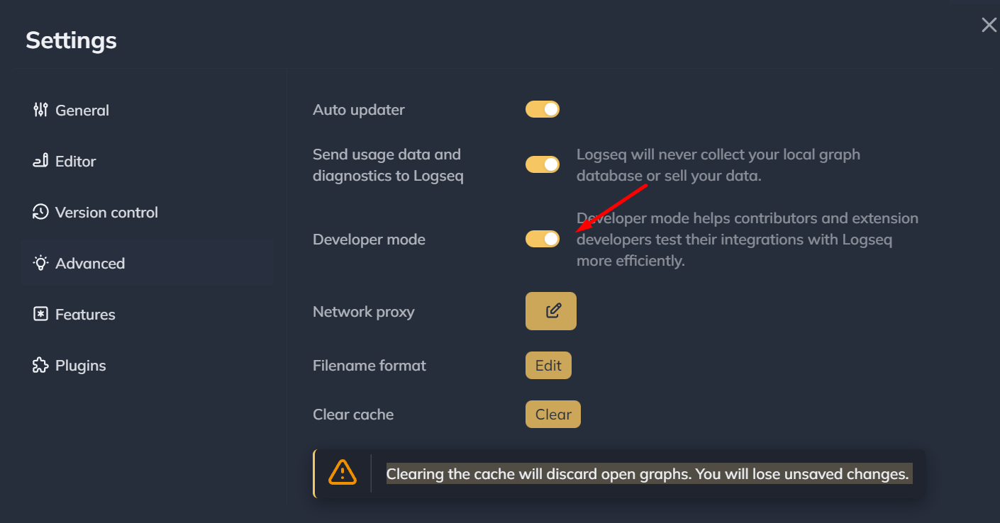
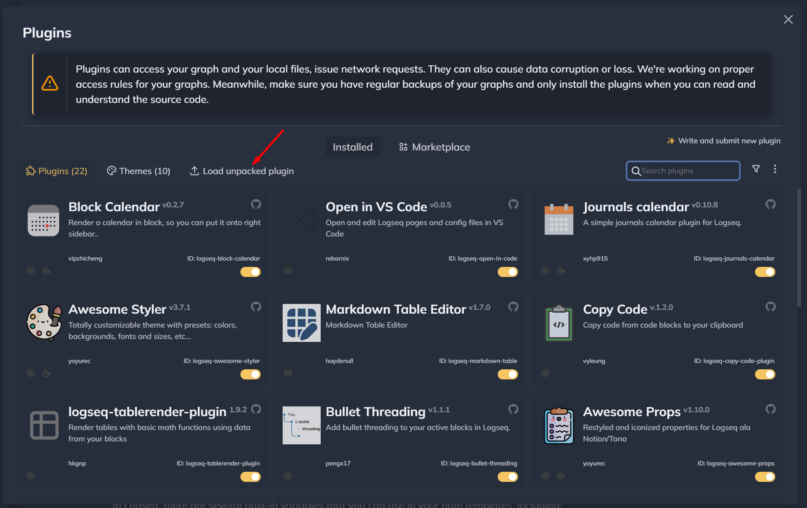

# logseq-template-button
Logseq plugin that helps creating a template button to insert new pages from a given template.

## 👣 Instructions

1. Fetching and installing dependencies:

   On the root folder of the repository, type the following command: 

    ```bash
    yarn install
    ```

2. Build the plugin executable:

    ```bash
    yarn build
    ```
3. Enable Developer Mode in Settings > Advanced Developer Mode.

    

4. Install plugin into Logseq using Plugins > Load unpacked plugin button.

   


4. Select the dist folder inside your project folder.


5. 